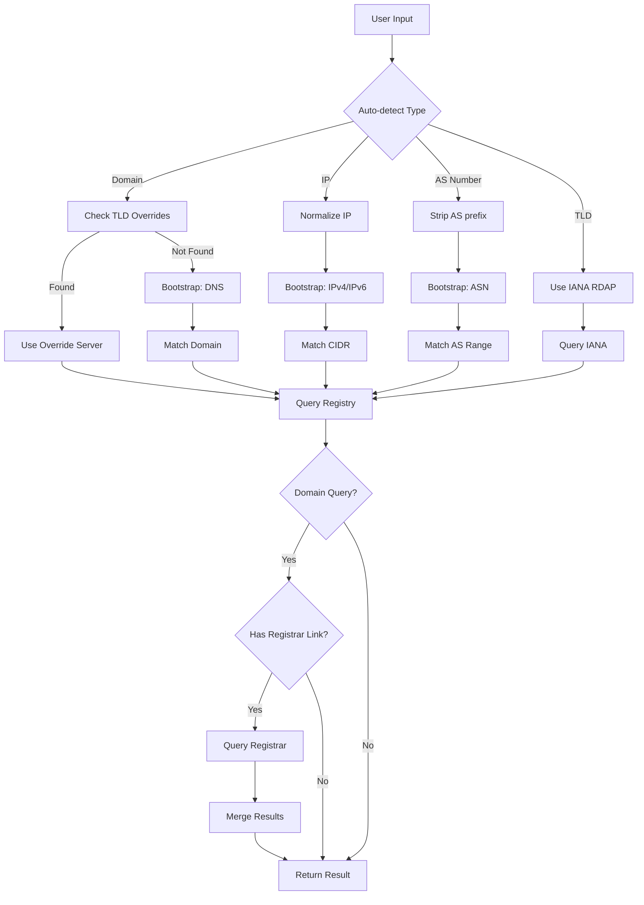

## Overview

The RDAP Rust client is designed with a modular architecture that separates concerns between query detection, bootstrap discovery, caching, HTTP communication, and response formatting. The client implements RFCs 7480-7484 for RDAP protocol compliance.

## Core Components

### Client Layer (`client.rs`)

The `RdapClient` is the main orchestrator that:
- Manages HTTP connections with connection pooling via `reqwest`
- Coordinates with the bootstrap service for server discovery
- Handles multi-layer RDAP queries (registry + registrar for domains)
- Parses JSON responses into typed Rust structs
- Follows registrar referral links automatically
- Implements retry logic for IPv6 CIDR queries

```rust
let client = RdapClient::new()?;
let request = RdapRequest::new(QueryType::Domain, "example.com");
let result = client.query(&request).await?;
```

### Bootstrap Discovery (`bootstrap.rs`)

The `BootstrapClient` implements RFC 7484 service discovery:
- Fetches IANA bootstrap registries (DNS, ASN, IPv4, IPv6)
- Matches queries to authoritative RDAP servers
- Supports TLD overrides for ccTLDs not in IANA bootstrap
- Handles domain matching from most specific to least specific
- Performs IP-to-CIDR matching using `ipnet` crate
- Matches AS number ranges

**Priority for domain lookups:**
1. TLD overrides from `tlds.json` (for ccTLDs)
2. IANA bootstrap registry matching

### Request Building (`request.rs`)

The `RdapRequest` structure:
- Auto-detects query type from input string
- Normalizes IP addresses (shorthand → standard)
- Builds proper RDAP URLs for each query type
- Supports explicit server override

**Query type detection flow:**
```
Input → Detect Type → Normalize → Build URL
  ↓
"1.1"      → Ip    → "1.0.0.1"     → /ip/1.0.0.1
"AS15169"  → Autnum → "15169"       → /autnum/15169
"google"   → Tld   → "google"       → /domain/google
"example.com" → Domain → "example.com" → /domain/example.com
```

### Configuration System (`config.rs`)

Multi-tier configuration with priority loading:

<Accordion title="Configuration Priority Order">
```
1. ~/.config/rdap/*.local.json  (User local overrides, never updated)
2. ~/.config/rdap/*.json        (Downloaded via rdap --update)
3. /etc/rdap/*.json             (System-wide configs)
4. Built-in defaults            (Embedded in binary)
```

**Configuration files:**
- `config.json` - Bootstrap URLs for IANA RDAP services
- `tlds.json` - TLD-to-server mappings for ccTLDs
- `tlds.txt` - IANA TLD list for query type detection
- `*.local.json` - User overrides (merged, not replaced)
</Accordion>

The configuration system ensures zero-config usage while allowing customization.

### Cache Layer (`cache.rs`)

Disk-based caching for bootstrap files:
- Location: `~/.cache/rdap/`
- Default TTL: 24 hours
- Automatically expires stale entries
- Reduces latency for repeated queries
- Minimizes load on IANA bootstrap services

## Query Flow Diagram



## Multi-Layer RDAP Queries

For domain queries, the client implements a two-tier query system:

<Note>
**Registry vs Registrar Data**

RDAP follows a hierarchical model:
- **Registry** (e.g., Verisign for .com) - Maintains authoritative data for the TLD
- **Registrar** (e.g., MarkMonitor) - Manages individual domain registrations

The client queries both layers to provide complete information.
</Note>

### Multi-Layer Query Process

1. **Registry Query**: Query the TLD registry first
   ```
   https://rdap.verisign.com/com/v1/domain/example.com
   ```

2. **Extract Referral**: Parse registry response for registrar link
   ```json
   {
     "links": [
       {
         "rel": "related",
         "href": "https://rdap.markmonitor.com/rdap/domain/example.com",
         "type": "application/rdap+json"
       }
     ]
   }
   ```

3. **Registrar Query**: Follow the referral link automatically
   ```
   https://rdap.markmonitor.com/rdap/domain/example.com
   ```

4. **Result**: Return both registry and registrar data
   - Registry data: Nameservers, DNSSEC, basic status
   - Registrar data: Detailed contacts, updated status, additional info

<Tip>
Use `--no-referral` flag to disable registrar queries and get only registry data.
</Tip>

## IP Address Handling

### Normalization

The client supports shorthand IP notation:

```rust
// src/ip.rs
"1.1"     → "1.0.0.1"
"8.8"     → "8.0.0.8"
"192.168" → "192.168.0.0"
```

### CIDR Support

Both standard IPs and CIDR ranges are supported:
- `8.8.8.8` - Single IP query
- `8.8.8.0/24` - CIDR range query
- `2001:db8::/32` - IPv6 CIDR

### IPv6 CIDR Retry Logic

Some RDAP servers (e.g., TWNIC) don't support host-level IPv6 queries. The client automatically retries with CIDR prefixes:

```
Query: 2001:db8::1
  ↓ (400 error)
Retry: 2001:db8::/64
  ↓ (400 error)
Retry: 2001:db8::/48
  ↓ (success)
```

## Response Parsing

The client uses Rust's type system for safe response handling:

```rust
pub enum RdapObject {
    Domain(Domain),
    Entity(Entity),
    Nameserver(Nameserver),
    Autnum(Autnum),
    IpNetwork(IpNetwork),
    DomainSearch(SearchResult<Domain>),
    EntitySearch(SearchResult<Entity>),
    NameserverSearch(SearchResult<Nameserver>),
    Help(Help),
    Error(ErrorResponse),
}
```

Response type is determined by:
1. Checking for `errorCode` field → `Error`
2. Checking for search result fields → `*Search`
3. Reading `objectClassName` field → specific type
4. Default → `Help`

## Configuration Update Mechanism

The `rdap --update` command:

1. Downloads latest configs from GitHub:
   - `config.json` - Bootstrap URLs
   - `tlds.json` - TLD overrides
   - `tlds.txt` - IANA TLD list

2. Validates JSON before saving

3. Preserves `*.local.json` user overrides

4. Saves to `~/.config/rdap/`

<Warning>
Local override files (`*.local.json`) are never modified by updates. Use these for custom configurations.
</Warning>

## Error Handling

The client uses a comprehensive error type:

```rust
pub enum RdapError {
    Bootstrap(String),           // Bootstrap discovery failed
    Http(reqwest::Error),        // HTTP request failed
    Json(serde_json::Error),     // JSON parsing failed
    InvalidQuery(String),        // Invalid query format
    NotFound,                    // 404 from RDAP server
    ServerError { ... },         // RDAP error response
    NoWorkingServers,            // All bootstrap servers failed
    Io(std::io::Error),          // File I/O error
    Other(String),               // Other errors
}
```

## Performance Optimizations

### Connection Pooling
- Uses `reqwest::Client` with automatic connection reuse
- Single client instance for all queries
- Reduces TLS handshake overhead

### Caching
- Bootstrap registries cached for 24 hours
- Eliminates repeated IANA queries
- Significant latency reduction for batch queries

### Async I/O
- Built on Tokio async runtime
- Non-blocking HTTP requests
- Concurrent registrar queries

### Binary Size
- Release binary: ~4MB (stripped)
- Embedded configs reduce runtime I/O
- Static linking for portability

## Thread Safety

<Note>
The `RdapClient` is NOT `Sync` by default due to internal HTTP client state. For concurrent usage, wrap in `Arc<Mutex<RdapClient>>` or create separate client instances per thread.
</Note>

```rust
// Shared client pattern
use std::sync::Arc;
use tokio::sync::Mutex;

let client = Arc::new(Mutex::new(RdapClient::new()?));

// In async handler
let client = client.lock().await;
let result = client.query(&request).await?;
```
